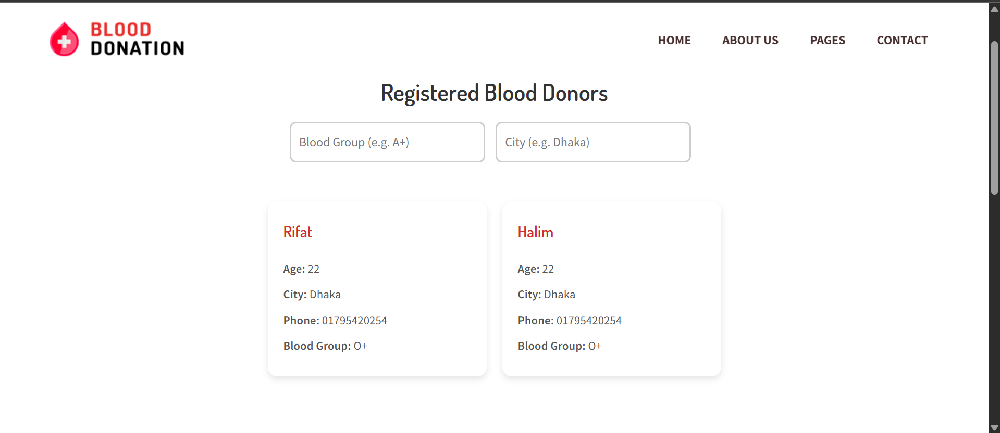
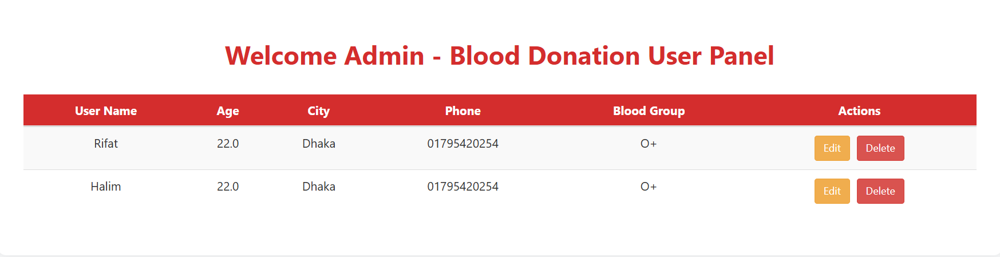

# 🩸 Blood Donation Web Application

A full-featured blood donation campaign website built with **Spring Boot**, **Thymeleaf**, and **MySQL**.  
Supports user registration, admin login, dashboard management, email notifications, and more — all wrapped in a blood-donation-themed UI.

---

## 📸 Screenshots

<h3>🏠 Home</h3>


<h2>🏠 After Login</h2>


<h2>👥 About Us</h2>


<h2>📋 User List</h2>


<h2>🛠️ Admin Dashboard</h2>



---

## ⚙️ Features

- 🧾 **User Registration & Login**
- 🔐 **Separate Admin Login**
- 🔄 **Smart Redirects After Logout**
- ✏️ **Admin Dashboard (View, Edit, Delete Users)**
- 🔍 **Live Search by Blood Group & City**
- 📬 **Contact Form with Email Notifications**
- 📁 **Responsive Design & Theme Styling**
- 🔓 **Public Pages** – Gallery, FAQ, About Us, Contact

---

## 🏗️ Tech Stack

| Layer        | Technology                      |
|--------------|----------------------------------|
| Backend      | Spring Boot (Java)              |
| Frontend     | Thymeleaf, HTML5, CSS3, JS      |
| Security     | Spring Security (BCrypt Auth)   |
| Database     | MySQL                           |
| Email        | Spring Mail + Gmail SMTP        |
| Theme        | Bootstrap + Custom UI Styling   |

---

## 🚀 Getting Started

### 🔹 1. Clone the Repository

```bash
git clone https://github.com/your-username/blood-donation-app.git
cd blood-donation-app
```

### 🔹 2. Set Up MySQL Database

- Create a database named `blood_donation`
- Import your schema if necessary(Schema given below)

### 🔹 3. Configure `application.properties`

```properties
spring.datasource.url=jdbc:mysql://localhost:3306/blood_donation
spring.datasource.username=your-db-username
spring.datasource.password=your-db-password

spring.mail.username=your-gmail@gmail.com
spring.mail.password=your-app-password
```

> 💡 Use an [App Password](https://support.google.com/accounts/answer/185833?hl=en) for Gmail if 2FA is enabled

### 🔹 4. Run the Application

```bash
./mvnw spring-boot:run
```
Open in browser: [http://localhost:8080](http://localhost:8080)

---

## 🧪 Default Admin Credentials

```
Username: admin
Password: admin123
```

> Configured in `SecurityConfig.java`

---

## 🧑‍💻 Developer Setup

- Java 21+(I use 24)
- Maven 3.8+
- MySQL Workbench
- IDE (IntelliJ IDE Ultimate Version Recommended)

---


---

## 🗂️ Database Schema

Table: `users`

| Column Name   | Type          | Constraints             |
|---------------|---------------|--------------------------|
| id            | INT           | Primary Key, Auto-Increment |
| userName      | VARCHAR(255)  |                          |
| password      | VARCHAR(255)  |                          |
| city          | VARCHAR(255)  |                          |
| age           | FLOAT         |                          |
| phone         | VARCHAR(255)  |                          |
| blood_group   | VARCHAR(255)  |                          |


## 📌 Future Enhancements

- 🗺️ Filter donors by distance
- 🔔 SMS/email reminder for donors
- 🖼️ Donor profile with image uploads
- 📆 Appointment booking system
- 📊 Admin dashboard with stats

---

## 🙌 Contributing

Pull requests welcome! Please open an issue first to discuss major changes.

---

## 🧾 License

Licensed under the [MIT License](LICENSE).

---

## 👤 Author

**Ahtasham Halim Rifat**  
[GitHub Profile](https://github.com/halimAhtasham)
